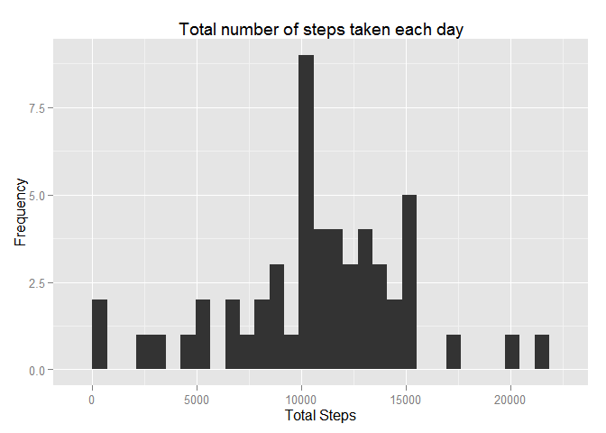
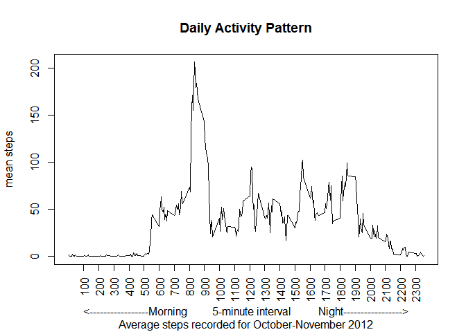
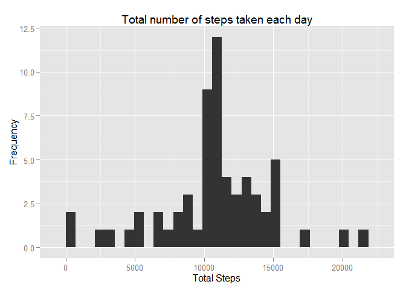
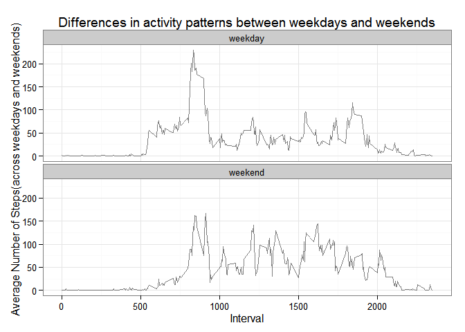

# Reproducible Research: Peer Assessment 1
ESSOMBA NKOULOU  
November 13, 2015  


## Loading and preprocessing the data

Setting the working directory on my local computer

```r
setwd("C:/Users/LENOVO/Documents/Reproducible Research")
```
Loading required packages


```r
require("dplyr") 
require("data.table")
require("ggplot2") 
require("lattice")
require("knitr")
require("rmarkdown")
#require("plyr")
```

Next we download and  read in the data from the local zipped file to the object activty which is converted into a tbl class


```r
urlData <- "http://d396qusza40orc.cloudfront.net/repdata/data/activity.zip"
download.file(urlData, "activity.zip")
activity <- read.csv(unz("activity.zip","activity.csv"))
activity <- tbl_df(activity)
```
## What is mean total number of steps taken per day?

1. Calculate the total number of steps taken per day


```r
activity_days <- na.omit(activity) %>% group_by(date) %>% summarise(total.steps = sum(steps))
head(activity_days)
```

2. Make a histogram of the total number of steps taken each day

This is done using the ggplot2 package and the activity_days data frame


```r
qplot(total.steps, data=activity_days, main="Total number of steps taken each day", xlab="Total Steps", ylab="Frequency")
```

 

3. Calculate and report the mean and median of the total number of steps taken per day


```r
mean((activity_days$total.steps), na.rm = TRUE)
```

#### The mean number of steps taken per day is 10766.19


```r
median((activity_days$total.steps), na.rm = TRUE)
```

#### The median number of steps taken per day is 10765

## What is the average daily activity pattern?

1.Make a time series plot (i.e. type = "l") of the 5-minute interval (x-axis) and the average number of steps taken, averaged across all days (y-axis)

#### Let's create a factor of the interval - time of day - so that we can aggregate based on it


```r
activity$interval.factor <- as.factor(activity$interval)
```

####we are now going to calculate the average number of steps for each interval using the group_by and summarise functions


```r
activity_interval <- activity %>% group_by(interval.factor) %>% 
  summarise(mean.steps = mean(steps, na.rm =TRUE))
```

#### Let's Make a time series plot of the 5-minute interval (x-axis) and the average number of steps taken, averaged across all days (y-axis)

```r
activity_interval$interval <- as.numeric(as.character(activity_interval$interval.factor))
plot(activity_interval$interval, activity_interval$mean.steps, type = "l", xaxt="n", 
     xlab = "<-----------------Morning         5-minute interval          Night----------------->", 
     ylab = "mean steps", main = "Daily Activity Pattern", sub = "Average steps recorded for October-November 2012")
axis(1, at = seq(100, 2300, by = 100), las = 2)
```

 

2. Which 5-minute interval, on average across all the days in the dataset, contains the maximum number of steps?


```r
max_steps_interval <- which.max(activity_interval$mean.steps)
print(activity_interval[max_steps_interval,])
```


#### The 5 minute interval with the maximum number of steps is 835 with 206.17 steps.

## Imputing missing values

1. Calculate and report the total number of missing values in the dataset (i.e. the total number of rows with NAs)

```r
sum(is.na(activity$steps))
```

#### The number of rows with missing values (coded as NA) is 2304

### Sterategy for imputing missing values


*  join the two data.frames activity_interval  and activity into a new data.frame called imputedActivityData

* Then find the values of all NA values using is.na(imputedActivityData$steps) and update those with average values for thet interval


```r
imputedActivityData <- full_join(activity, activity_interval)
imputedActivityData$interval.factor <- NULL
head(imputedActivityData)
```

3. Create a new dataset that is equal to the original dataset, but with the missing data filled in. 

```r
imputedActivityData$steps[is.na(imputedActivityData$steps)] <- imputedActivityData$mean.steps
head(imputedActivityData)
sum(is.na(imputedActivityData$steps))
```

4. Make a histogram of the total number of steps taken each day and Calculate and report the mean and median total number of steps taken per day. Do these values differ from the estimates from the first part of the assignment? What is the impact of imputing missing data on the estimates of the total daily number of steps?


Let's Calculate the  total number of steps in imputed data and plot histogram

```r
totalDayStepsImputed <- imputedActivityData %>% group_by(date) %>% 
  summarise(total.steps = sum(steps))

qplot(total.steps, data=totalDayStepsImputed, main="Total number of steps taken each day", xlab="Total Steps", ylab="Frequency")
```

 

Let's Calculate and report the mean and median total number of steps taken per day

```r
mean(totalDayStepsImputed$total.steps)
```

The mean number of steps taken per day is 10766.19


```r
median(totalDayStepsImputed$total.steps)
```

The median number of steps taken per day is 10766.19

The new imputed values are same as the initial value for the mean  as the data was imputed using the average values for each time interval

## Are there differences in activity patterns between weekdays and weekends?

1. Let's create a new factor variable in the dataset with two levels - "weekday" and "weekend" indicating whether a given date is a weekday or weekend day.


```r
# weekday and weekend factors
weekImpActivityData <- imputedActivityData
weekImpActivityData$dayType <- "weekday"
# set up logical/test vector
weekend <- weekdays(as.Date(weekImpActivityData$date)) %in% c("Saturday", "Sunday") 

# Updating dayType to "Weekend" for which the value of logical vecor weekend is TRUE
weekImpActivityData$dayType[weekend] <- "weekend" 

# updating the datType to be a factor
weekImpActivityData$dayType <- factor(weekImpActivityData$dayType)
```

2. Make a panel plot containing a time series plot (i.e. type = "l") of the 5-minute interval (x-axis) and the average number of steps taken, averaged across all weekday days or weekend days (y-axis). 

Let's Create a dataset to calculate average of steps over weekdays and average of steps over weekends for each interval using dplyr package


```r
intervalMeanDayType <- weekImpActivityData %>% group_by(dayType, interval) %>% 
  summarise(mean.steps = mean(steps))

dayTypePlot <- ggplot(intervalMeanDayType, aes(interval, mean.steps))
dayTypePlot + geom_line(alpha=1/2) + facet_wrap(~ dayType, ncol=1) + labs(x ="Interval") + labs(y="Average Number of Steps(across weekdays and weekends)") + labs(title="Differences in activity patterns between weekdays and weekends") + theme_bw()
```

 

There exists clear differences in activity between weekends and weekdays, which is understandable as most 
people are more active in the weekends than they are during the week.


